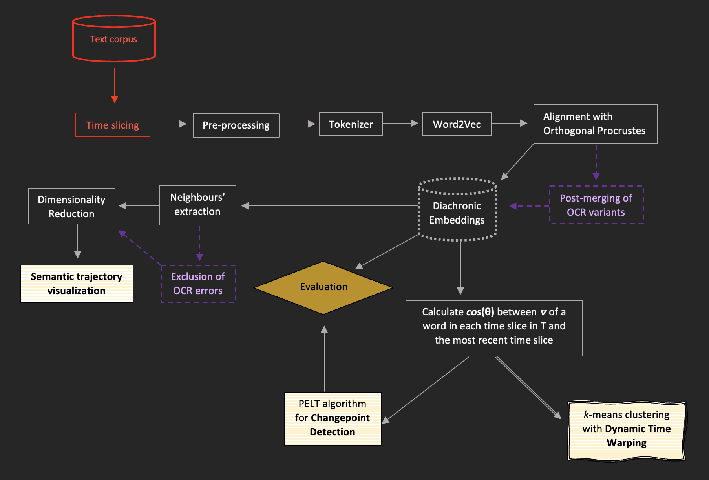
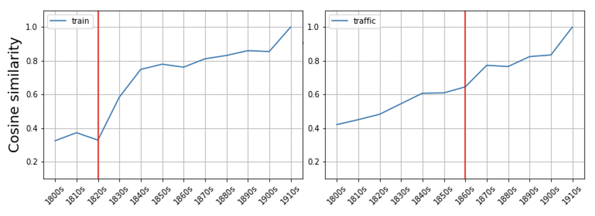
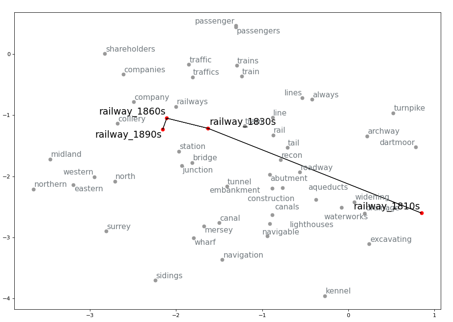
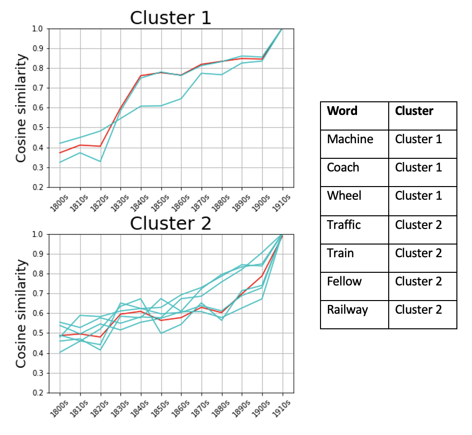

<div align="center">
    <br>
    <p align="center">
    <h1>DiachronicEmb-BigHistData</h1>
    </p>
    <h2>Tools to train and explore diachronic word embeddings from Big Historical Data</h2>
</div>
 
<p align="center">
  <a href="/LICENSE">

  </a>
    <a href="https://github.com/Living-with-machines/DiachronicEmb-BigHistData/actions/workflows/ci_test_ubuntu.yml/badge.svg">
  
  </a>
  <a href="https://github.com/Living-with-machines/DiachronicEmb-BigHistData/actions/workflows/ci_test_macos.yml/badge.svg">
  
  </a>
</p>


Table of contents
-----------------
- [Overview of the tools](#overview-of-the-tools)
- [Project structure](#project-structure)
- [Installation](#installation)
- [Data structure](#data-structure)
- [Train diachronic word embeddings](#train-diachronic-word-embeddings)
    * [Breakdown of outputs](#breakdown-of-outputs)
        - [Directories](#directories)
        - [Pre-processed texts](#pre-processed-texts)
        - [Raw models](#raw-models)
        - [Aligned models](#aligned-models)
    * [Computational costs](#computational-costs)
- [Post-processing (optional)](#post-processing-optional)
    * [Merging of vectors of spelling variants](#merging-of-vectors-of-spelling-variants)
- [Explore pre-trained diachronic word embeddings](#explore-pre-trained-diachronic-word-embeddings)
    * [Changepoint detection](#changepoint-detection)
    * [Visualize semantic change trajectory](#visualize-semantic-change-trajectory)
    * [K-means clustering with Dynamic Time Warping](#k-means-clustering-with-dynamic-time-warping)
- [Links, references and relevant literature](#links-references-and-relevant-literature)
    * [References and useful literature](#references-and-useful-literature)
    * [Useful links](#useful-links)
- [Appendix 1: Computational Costs](#appendix-1-computational-costs)
    * [Pre-processing](#pre-processing)
    * [Tokenization and Training](#tokenization-and-training)
- [Appendix 2: Pre-trained vectors](#appendix-2-pre-trained-vectors)

## Overview of the tools
The scripts presented in this repository were created to **train and explore diachronic word embeddings (Word2Vec) from very large historical data for which metadata on the year of publication of each text file is available**. While the mapping between texts and year of publication is essential (to get _diachronic_ embeddings), the methods presented can in principle be applied to any other diachronic collection. 

One of the main reasons why _Big Historical Data_ need specific tools compared to Big Data in general is mainly that more often than not we are dealing with OCR'd text generally containing a large amount of errors. This means that, together with the granularity-speed trade-off needed during preprocessing (common to Big Data in general), we also need extra steps to make sure that OCR errors are dealt with and that they figure in any evaluation framework we might choose to adopt when training embeddings from them.

Compared to smaller historical text collections, Big Historical Data and Big Data in general, because of their mere size, will typically undergo minimal preprocessing, since NLP tasks such as lemmatization, PoS tagging, morphological analysis or dependency annotation (used as 'preprocessing' steps in embedding architectures such as [[1]](#graphbasedemb) and [[5]](#levygold2014)) may be computationally unfeasible unless we subsample our corpus beyond the temporal variable. In fact, even minimal preprocessing may not be feasible by sticking only to one specific popular library (e.g. `spaCy`): instead, each preprocessing step will need to be optimized for computational costs by combining specific pipelines from different external libraries, as well as bespoke methods.

This repository is meant to provide an easy-to-reproduce pipeline whereby, given a series of text files each containing all the texts for one particular time unit, we can train diachronic embedding models and carry out semantic change analysis on them (including semantic change detection, visualization of meaning change trajectories, clustering of semantic change types). 

<p align="center">

</p>
<p align="center">
Fig. 1 - Flowchart of the methods, from preprocessing to time-series analysis. Red items indicate steps or data not provided by this repository. Purple items in any pre-analysis stage indicate optional steps. Sketched edges indicate methods which are still experimental (and, as such, without an established validation technique). Striped white-and-yellow boxes indicate methods which lead to final outputs for analysis.
</p>


## Project structure
```
BigHistDiachEmb
├─ README.md
└─ scripts
   ├─ exploration
   │    ├─ changepoint_detection.ipynb
   │    ├─ dynamic_time_warping.ipynb
   │    └─ visualize_diachronic_emb.ipynb
   ├─ postprocessing
   │    └─ merge_errors.py
   └─ training
        ├─ config.yaml
        ├─ train_diach_emb.py
        └─ utils.py
```

## Installation

### Prerequisites
The setup relies on the integration of [`pyenv`](https://github.com/pyenv/pyenv) and [`poetry`](https://python-poetry.org). Make sure you first install `pyenv` following [these instructions](https://github.com/pyenv/pyenv#installation) and `poetry` following [these instructions](https://python-poetry.org/docs/#installation).

### Clone the project
```
git clone https://github.com/Living-with-machines/DiachronicEmb-BigHistData.git
```

### Install Python version (pyenv)
Install `python 3.10.1`. This is the version on which this project has been tested (on MacOS and Linux/Ubuntu), so there is no guarantee that everything will run smoothly on other Python versions. To install it run:

```
pyenv install 3.10.1
```

And set it as the `global` version:

```
pyenv global 3.10.1
```

Restart the terminal for the changes to take effect:

```
exec bash -l
```

### Install virtual env and project dependencies (poetry)

Change directory to the current project:

```
cd DiachronicEmb-BigHistData
```

Create virtual environment and install project dependencies:

```
poetry install
```

To be able to use the Jupyter notebooks under `scripts/exploration`, create a Kernel which you will select when running the notebook:

```
poetry run ipython kernel install --user --name=bighistdiachemb
```


Then to start using the project scripts, activate the virutal environment:

```
poetry shell
```

You can now run a `.py` script as usual, for example:

```
python scripts/training/train_diach_emb.py
```

Or start a Jupyter session:

```
jupyter notebook
```


## Data structure
All the steps presented below assume that you start from one input TXT file for time slice. It is recommended that each line in the TXT file consist of topically (roughly) coherent units (e.g. sentences, articles, paragraphs). Make sure each file is named so that you can easily recognize which time slice they represent (the same name will be given to the respective model). For example, if you want to train one model per decade for the period 1840-1879, you may have: `1840s.txt`, `1850s.txt`, `1860s.txt`, `1870s.txt`.

## Specify some variables
Before starting, edit the [`config.yaml`](./config.yaml/) file with the relevant settings. The following is a complete breakdown of the variables you must or might wish to customize.

- `namethetest` (str): Give a name to the test run or training session (e.g. "diachronic_news"). This will be the name given to the directory which is automatically created during training and where all the outputs from the current session will be saved. 
- `inputs`:
    - `directory` (str): Folder where all the input `.txt` files are stored (e.g. "/input_news/").
- `preprocessing`:
    - `skip` (bool): Whether you want to skip preprocessing (e.g. in case you provide already preprocessed texts.
    - `savepreprocessed` (bool): If `skip` is `False`, whether you want to save the preprocessed `.txt` files or forget them after training.
    - `pipelines`:
        - `minwordlength` (int): Number of characters that a word needs to contain for it to be kept. Anything below this number will be removed from the text (e.g. `minwordlength = 3` will remove all 1- and 2-character words, such as *as* or *a*).
        - `lowercase` (bool): Whether you want the text to be lowercased.
        - `remove_punctuation` (bool): Whether you want to remove punctuation.
        - `remove_stopwords` (bool): Whether you want to remove stopwords.
            > __Note__: If `remove_stopwords = True`, the list of stopwords will be the English ones provided by `nltk`. To customize them, add your stopwords to the `cachedStopwords` list in the script [`train_diach_emb.py`](/scripts/training/train_diach_emb.py)
- `training`:
    - `skip` (bool): Whether you want to skip training (e.g. if you only wish to preprocess the texts and save them).
    - `w2v_options`:
        > __Note__: The following are the parameters that are passed onto `Word2Vec`. Their description below is taken from [here](https://radimrehurek.com/gensim/models/word2vec.html#gensim.models.word2vec.Word2Vec).
        - `epochs` (int): Number of iterations (epochs) over the corpus.
        - `vector_size` (int): Dimensionality of the word vectors.
        - `sg` (bool): Training algorithm: `True` for skip-gram; otherwise CBOW.
        - `min_count` (int):  Ignores all words with total frequency lower than this.
        - `window` (int): Maximum distance between the current and predicted word within a sentence.
        - `start_alpha` (float): Initial learning rate.
        - `end_alpha` (float): Final learning rate. 
        - `workers` (int): Use these many worker threads to train the model (=faster training with multicore machines).
- `alignment`:
    - `skip` (bool): Whether you want to skip alignment of the trained models via Orthogonal Procrustes. If `True`, the aligned models will be saved alongside the non-aligned ones (in separate directories, (`namethetest/outputs/aligned/` and `namethetest/outputs/raw/`, respectively)

## Train diachronic word embeddings
Preprocessing, training and alignment are all carried out by running one script:

```
python ./scripts/training/train_diach_emb.py
```

The three pipelines (preprocessing, training and alignment) can be applied one by one by setting the variable `skip` to `False` for only one of the three at a time in the `config.yaml` file (setting the other two to `True`), as described in the previous section. Especially if you are training diachronic embeddings on a very large historical dataset, it is in fact recommended to first preprocess and save the preprocessed texts (by setting the `savepreprocessed` variable to `True`) and to train and align the embeddings on a second run. The script saves the preprocessed texts under `./outputs/<namethetest>/` by default, so if the latter route is taken, change the variable `directory` to the folder where the new preprocessed texts are before running the script again for training and alignment.

### Breakdown of outputs
The following is a complete lists of possible outputs generated by the script.

#### Directories
> __Note__: These are only created if the directory does not already exist.
- `./outputs/`: This is the top level where all outputs are saved.
- `./outputs/<test_run_name>/`: Dedicated folder where all outputs from a specific test run will be saved. This is also the folder directly under which preprocessed texts are saved by default.
- `./outputs/<test_run_name>/raw/`: Dedicated folder for all raw (non-aligned) Word2Vec models.
- `./outputs/<test_run_name>/aligned/` (dir): Dedicated folder for all aligned Word2Vec models.

#### Pre-processed texts
The pre-processed texts are only saved if the `savepreprocessed` variable in the `config.yaml` file is set to `True`, in which case they are saved with the same name as the originals, directly under the folder `./outputs/<test_run_name>/`, which is automatically created when running the script.

#### Raw models
One model per time slice is saved under `./outputs/<test_run_name>/raw/` (automatically created when running the script), named after the original file, without the `.txt` extension, and with `.model` appended. For example, if you are training the embeddings on `1900.txt`, `1910.txt`, `1920.txt`, and `1930.txt`, the models will be named `1900.model`, `1910.model`, `1920.model`, and `1930.model`. Word2Vec may additionally generate two `.npy` files per model, depending on the size of each model.

#### Aligned models
The aligned versions of the raw models are saved under `./outputs/<test_run_name>/aligned/` (automatically created when running the script) and will have the same name as the raw ones.
> __Note__: The aligned model for the most recent time slice will be an exact copy of the raw one.


## Post-processing (optional)
### Merging of vectors of spelling variants
> __Warning__: This is still experimental and computationally expensive. The exploration scripts described in the next section do not assume any post-processing of the vectors.

Working with historical data often means dealing with OCR errors. A possible, though computationally expensive, way of partially counteracting the noise created in the embeddings trained on OCR'd texts is to attempt error correction. Doing so directly on the text sources would be computationally unfeasible for Big Data, so that another option is to post-merge the trained embeddings of highly likely OCR spelling variants, by averaging the vectors and keeping only the likely correct entry. The script `merge_errors.py` currently uses the `pyspellchecker` library, which is based on Levinshtein distance, to look for unknown entries, correct them, and average them with the other vectors for the same entry which resulted from the correction. To apply the spellchecker, simply run:

```
python ./scripts/postprocessing/merge_errors.py
```

Before running the script, edit the variables `modelpath` with the path to the model whose word vectors you wish to spellcheck and `newmodelname` with the name (including `.txt` extension) you wish to give to the new vector file. The output will be a non-binary file containing the new vectors list only, saved by default in the same directory as the original model.
> __Note__: The spellchecker will only merge misspellings with the most likely correct variant, but will not remove identified misspelling for which a possible correction has not been identified.

## Explore pre-trained diachronic word embeddings
Under `./scripts/exploration` you can find three different notebooks to get you started at exploring the diachronic vector spaces trained using the method laid out above. Below we provide a brief description of what you can achieve with each of them given diachronic word embedding models.

### Changepoint detection
> Notebook: `changepoint_detection.ipynb`.
<p align="center">

</p>
<p align="center">
Fig. 2 - Example of change points detected for <i>train</i> and <i>traffic</i>
</p>

Given a word (o set thereof), this notebook takes you through how you can detect semantic change points in pre-trained diachronic word embeddings by leveraging the cosine similarity between the vector of the word in the most recent time slice and each of the previous timeslices. We use the [PELT algorithm](https://centre-borelli.github.io/ruptures-docs/user-guide/detection/pelt/), as implemented in the [`ruptures`](https://centre-borelli.github.io/ruptures-docs/) library, to detect potential change points.

### Visualize semantic change trajectory
> Notebook: `visualize_trajectory.ipynb`.

<p align="center">

</p>
<p align="center">
Fig. 3 - Diachronic semantic trajectory of <i>railway</i> in the 19th century,.
</p>

In this notebook we will see how to visualize the semantic trajectory of a word across time slices, based on the changes in nearest neighbours from one time slice to the next. 

We assume that the diachronic embeddings used to visualize the trajectory were trained on OCR'd texts and therefore contain OCR errors, which is why the `spellchecker` package is incorporated to attempt automatically reducing the number of mispellings showing up among the nearest neighbours. A further (optional) step for manual cleaning is also introduced before generating visualization such as the one in Fig. 3.

### K-means clustering with Dynamic Time Warping
> Notebook: `time_series_clustering.ipynb`.
<p align="center">

</p>
<p align="center">
Fig. 4 - Example of <i>k</i>-means clustering with Dynamic Time Warping as core metric.
</p>

This notebook shows how to perform _k_-means clustering of time-series data derived from the vectors of different words in different time slices, using [Dynamic Time Warping](https://en.wikipedia.org/wiki/Dynamic_time_warping) (DTW) as a core metric - a technique for time-series comparison. The goal is to cluster the semantic trajectories of different words in order to get insights into the several ways in which a word can undergo meaning change in the same timespan.

## Links, references and relevant literature
> __Note__: This list is not exhaustive.

### References and useful literature

<a id="graphbasedemb">[1]</a> 
Ragheb Al-Ghezi and Mikko Kurimo. 2020. Graph-based Syntactic Word Embeddings. In Proceedings of the Graph-based Methods for Natural Language Processing (TextGraphs), pages 72–78, Barcelona, Spain (Online). Association for Computational Linguistics. http://dx.doi.org/10.18653/v1/2020.textgraphs-1.8

<a id="hamilton">[2]</a> 
William L. Hamilton, Jure Leskovec, and Dan Jurafsky. 2016. Diachronic Word Embeddings Reveal Statistical Laws of Semantic Change. In Proceedings of the 54th Annual Meeting of the Association for Computational Linguistics (Volume 1: Long Papers), pages 1489–1501, Berlin, Germany. Association for Computational Linguistics. http://dx.doi.org/10.18653/v1/P16-1141

<a id="kim">[3]</a> 
Yoon Kim, Yi-I Chiu, Kentaro Hanaki, Darshan Hegde, and Slav Petrov. 2014. Temporal Analysis of Language through Neural Language Models. In Proceedings of the ACL 2014 Workshop on Language Technologies and Computational Social Science, pages 61–65, Baltimore, MD, USA. Association for Computational Linguistics. http://dx.doi.org/10.3115/v1/W14-2517

<a id="kutuzov">[4]</a> 
Andrey Kutuzov, Lilja Øvrelid, Terrence Szymanski, and Erik Velldal. 2018. Diachronic word embeddings and semantic shifts: a survey. In Proceedings of the 27th International Conference on Computational Linguistics, pages 1384–1397, Santa Fe, New Mexico, USA. Association for Computational Linguistics. https://aclanthology.org/C18-1117

<a id="levygold2014">[5]</a> 
Omer Levy and Yoav Goldberg. 2014. Dependency-Based Word Embeddings. In Proceedings of the 52nd Annual Meeting of the Association for Computational Linguistics (Volume 2: Short Papers), pages 302–308, Baltimore, Maryland. Association for Computational Linguistics. http://dx.doi.org/10.3115/v1/P14-2050

<a id="roomtoglo">[6]</a> 
Philippa Shoemark, Farhana Ferdousi Liza, Dong Nguyen, Scott Hale, and Barbara McGillivray. 2019. Room to Glo: A Systematic Comparison of Semantic Change Detection Approaches with Word Embeddings. In Proceedings of the 2019 Conference on Empirical Methods in Natural Language Processing and the 9th International Joint Conference on Natural Language Processing (EMNLP-IJCNLP), pages 66–76, Hong Kong, China. Association for Computational Linguistics. http://dx.doi.org/10.18653/v1/D19-1007

<a id="dukweb">[7]</a> 
Tsakalidis, A., Basile, P., Bazzi, M. et al. DUKweb, diachronic word representations from the UK Web Archive corpus. Sci Data 8, 269 (2021). https://doi.org/10.1038/s41597-021-01047-x

<a id="gcnemb">[8]</a> 
Shikhar Vashishth, Manik Bhandari, Prateek Yadav, Piyush Rai, Chiranjib Bhattacharyya, and Partha Talukdar. 2019. Incorporating Syntactic and Semantic Information in Word Embeddings using Graph Convolutional Networks. In Proceedings of the 57th Annual Meeting of the Association for Computational Linguistics, pages 3308–3318, Florence, Italy. Association for Computational Linguistics. http://dx.doi.org/10.18653/v1/P19-1320


### Useful links
- [Word2Vec as implemented in Gensim](https://radimrehurek.com/gensim/models/word2vec.html)

### TODO
- [ ] Add options for training using algorithms other than just Word2Vec.
- [ ] Add link to published related paper (forthcoming).
- [x] Add link to deposited pre-trained models (coming soon!).

## Appendix 1: Computational costs

### Pre-processing
> Sample: **4.7 billion words** (ca 20GB of TXT)

Time taken: **7 hours and 32 minutes** on MacOS (16GB RAM).

### Tokenization and training

> Sample: **9,389,676** sentences (680.1 MB TXT file)
- On MacOS (16GB RAM):
    * time to tokenize: **1.5 mins**.
    * time to train a model: **27 mins**
    * TOT: **30 mins**
- On Ubuntu (16 VCPUs, 64 GB RAM):
    * time to tokenize: **1 min**.
    * time to train a model: **16 mins**
    * TOT: **19 mins**

> Sample: **13,495,444** sentences (906.5 MB TXT file)
- On MacOS (16GB RAM):
    * time to tokenize: **2 mins**.
    * time to train a model: **37 mins**
    * TOT: ca. **41 mins**
- On Ubuntu (16 VCPUs, 64 GB RAM):
    * time to tokenize: **2 mins**.
    * time to train a model: **32 mins**
    * TOT: **39 mins**

> Sample: **14,678,780** sentences (693.4 MB TXT file)
- On MacOS (16GB RAM):
    * time to tokenize: **2 mins**.
    * time to train a model: **18 mins**
    * TOT: **20 mins**
- On Ubuntu (16 VCPUs, 64 GB RAM):
    * time to tokenize: **2.5 mins**.
    * time to train a model: **26 mins**
    * TOT: **30 mins**

> Sample: **23,530,425** sentences (1.2 GB TXT file)
- On MacOS (16GB RAM):
    * time to tokenize: **3 mins**.
    * time to train a model:  **32 mins**
    * TOT: **35 mins**
- On Ubuntu (16 VCPUs, 64 GB RAM):
    * time to tokenize: **2.5 mins**.
    * time to train a model: **51 mins**
    * TOT: **53 mins**

> Sample: **27,021,377** sentences (1.7 GB TXT file)
- On MacOS (16GB RAM):
    * time to tokenize: **10 mins**.
    * time to train a model: **1h**
    * TOT: **1h 10 mins**
- On Ubuntu (16 VCPUs, 64 GB RAM):
    * time to tokenize: **3.5 mins**.
    * time to train a model: **1h 15 mins**
    * TOT: **1h 20 mins**

> Sample: **30,181,001** sentences (2.2 GB TXT file)
- On MacOS (16GB RAM):
    * time to tokenize: **4 mins**.
    * time to train a model: **1h 4 mins**
    * TOT:  **1h 11 mins**
- On Ubuntu (16 VCPUs, 64 GB RAM):
    * time to tokenize: **4.5 mins**.
    * time to train a model: **1h 8 mins**
    * TOT:  **1h 10 mins**

> Sample: **34,077,373** sentences (1.9 GB TXT file)
- On MacOS (16GB RAM):
    * time to tokenize: **4 mins**.
    * time to train a model: **52 mins**
    * TOT: **56 mins**
- On Ubuntu (16 VCPUs, 64 GB RAM):
    * time to tokenize: **5 mins**.
    * time to train a model: **1h 25 mins**
    * TOT: **1h 30 mins**

> Sample: **34,126,059** sentences (2.2 GB TXT file)
- On MacOS (16GB RAM):
    * time to tokenize: **13 mins**.
    * time to train a model: **1h 17 mins**
    * TOT: **1 h 50m**
- On Ubuntu (16 VCPUs, 64 GB RAM):
    * time to tokenize: **5.5 mins**.
    * time to train a model: **1h 40 mins**
    * TOT: **1 45 min**

> Sample: **35,716,553** sentences (2.2 GB TXT file)
- On MacOS (16GB RAM):
    * time to tokenize: **4.5 mins**.
    * time to train a model: **1h 6 mins**
    * TOT: **1h 15 mins**
- On Ubuntu (16 VCPUs, 64 GB RAM):
    * time to tokenize: **4.5 mins**.
    * time to train a model: **1h 40 mins**
    * TOT: **1h 45 mins**

> Sample:  **37,786,194** sentences (2.5 GB TXT file)
- On MacOS (16GB RAM):
    * time to tokenize: **5 mins**.
    * time to train a model: **1h 10 mins**
    * TOT: **1h 15 mins**
- On Ubuntu (16 VCPUs, 64 GB RAM):
    * time to tokenize: **5.5 mins**.
    * time to train a model: **1h 40min**
    * TOT: **1h 45 mins**

### Merging of vectors (post-correction of OCR errors)
To load a model, extract its keys, check the spelling for **356,429 word vectors** and merge the mispellings it took: **4.40 hours**. 
> __Warning__: 258,944 out of 356,429 words were considered mispellings! Out of the remaiining 97,484 words there are still certainly several mispellings, which SpellChecker did not manage to correct. Use this pipeline wisely.

## Appendix 2: Pre-trained vectors
[Here](https://doi.org/10.5281/zenodo.7181681) you can download pre-trained diachronic embeddings trained on a 4.2B-word corpus of 19th-century British newspapers, divided by decades. If you use the pre-trained vectors, please cite:

> Pedrazzini, Nilo & Barbara McGillivray. 2022. _Diachronic word embeddings from 19th-century British newspapers_ [Data set]. Zenodo. DOI: https://doi.org/10.5281/zenodo.7181682

```
@dataset{pedrazzinimcgilli_diachemb19data,
  author       = {Nilo Pedrazzini and
                  Barbara McGillivray},
  title        = {{Diachronic word embeddings from 19th-century 
                   British newspapers}},
  year         = 2022,
  publisher    = {Zenodo},
  doi          = {10.5281/zenodo.7181682},
  url          = {https://doi.org/10.5281/zenodo.7181682}
}
```
